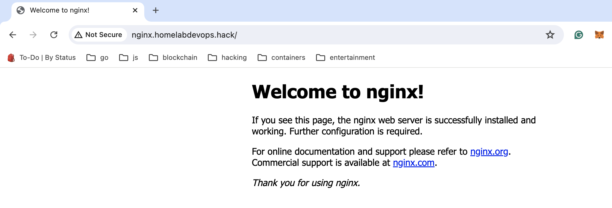

# Nginx deployment testing with Ingress controller + local domain setup
---

    Basic nginx app deployment with 2 replicas deployed onto the kind cluster with Nginx ingress controller.

*Note:*

    The ingress controller is mapped to dsnmacq local setup and the local registered domain is nginx.homelabdevops.hack, so the main goal is to achieve:
       

- Setup Kind cluster
- Nginx ingress controller 
- Calico CNI
- local domain setup using dnsmacq
- Finally test the deployment with local domain

---

```sh
    The nginx-app folder contains helm template to deploy nginx with ingress custom domain.
    Service type should be of nodeport.
    release.yaml file contains the final object yaml derived from helm templating
```

usage:
```
helm template --dry-run nginx-v1 ./nginx-app > release.yaml
kubctl apply -f release.yaml
```

